# SlopeCraft v3.1 Tutorial

**I'm TokiNoBug, the developer of SlopeCraft.** Here I will teach you how to creat a map painting of 3D, flat or a file-only one using SlopeCraft.

SlopeCraft supports ui in English at version 3.1, as it is shown below.

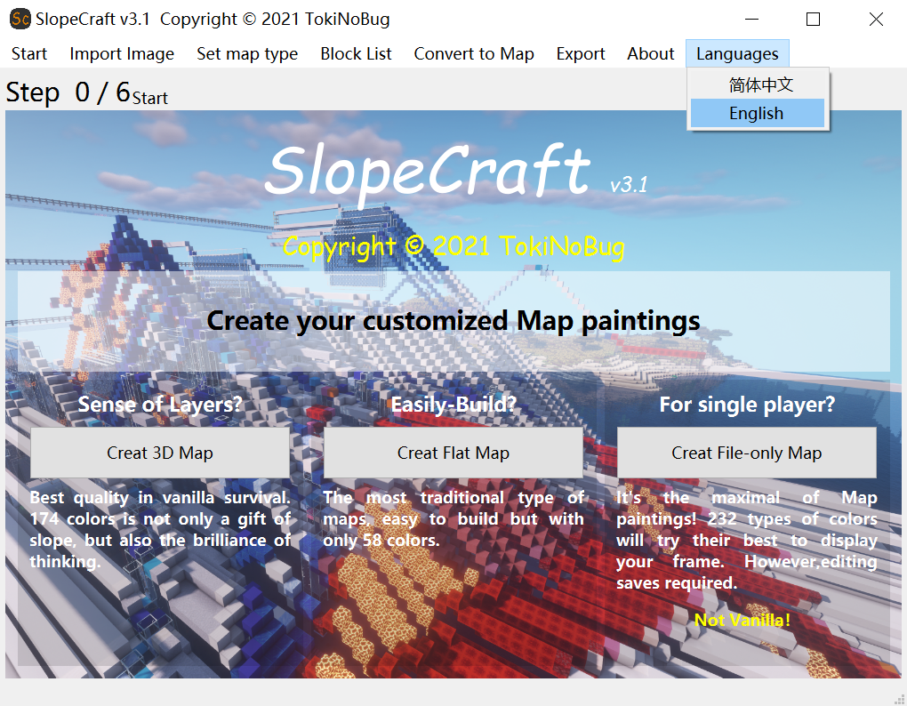

You can switch to English under the pull down menu.

## Step 1  Pretreating Your Image

1. First prepare a source image that you want to convert to map painting.
   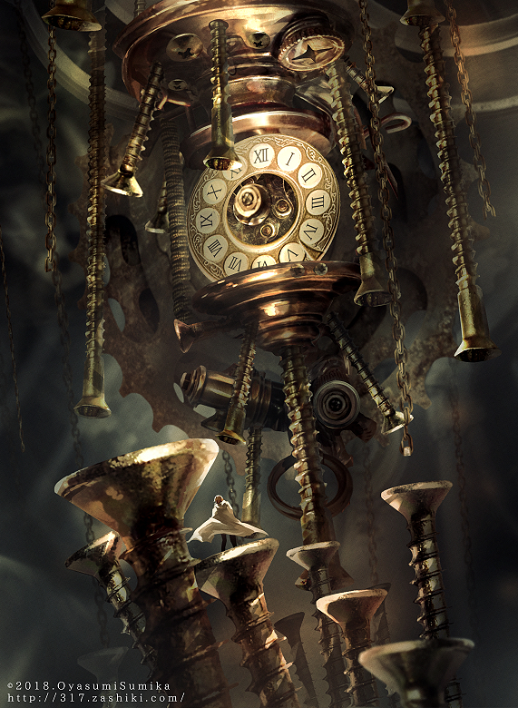

2. **Scale the width and height of your image to any multiple of 128 pixels**, with any image editor, like Photoshop.
   Here I scale it to 256×256px, which is right the size of a 2×2 map painting.

   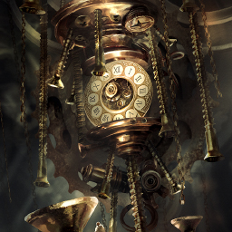

   (To be honest SlopeCraft won't go on strike even you don't resize it)

3. Save your pretreated image.

## Step 2  Convert image to map paintings

Most images we see have 256×256×256 colors, however we have less than 256 colors in Minecraft map paintings. The number of colors we can actually call was even less. Thus, it's a must to convert every pixel to Minecraft map colors.
1. Download and start SlopeCraft
   
   

   - For 3D maps, click **Creat 3D Map**;

   - For traditional flat maps, click **Creat Flat Map**;

   - If you don't want your map paintings exist as tons of blocks in minecraft but shown only as map items put into item frames, please click **Creat File-only Map**.
  
   Notice that these kinds of maps require replacing some files in your saves, and even commands. File-only maps is suitable for only singel-player games. It's also ok if you're an administrator of a server.

2. Import image
   
   You will jump to the next page automatically after finishing previous step.

   Click **Import Image** and select the pretreated image. It will be loaded into SlopeCraft.

   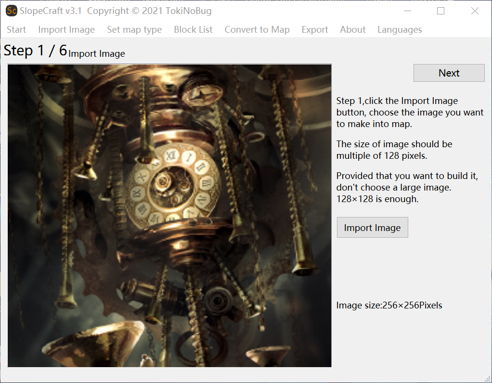

   Click **Next** and go on.

3. Set the type of map paintings
   
   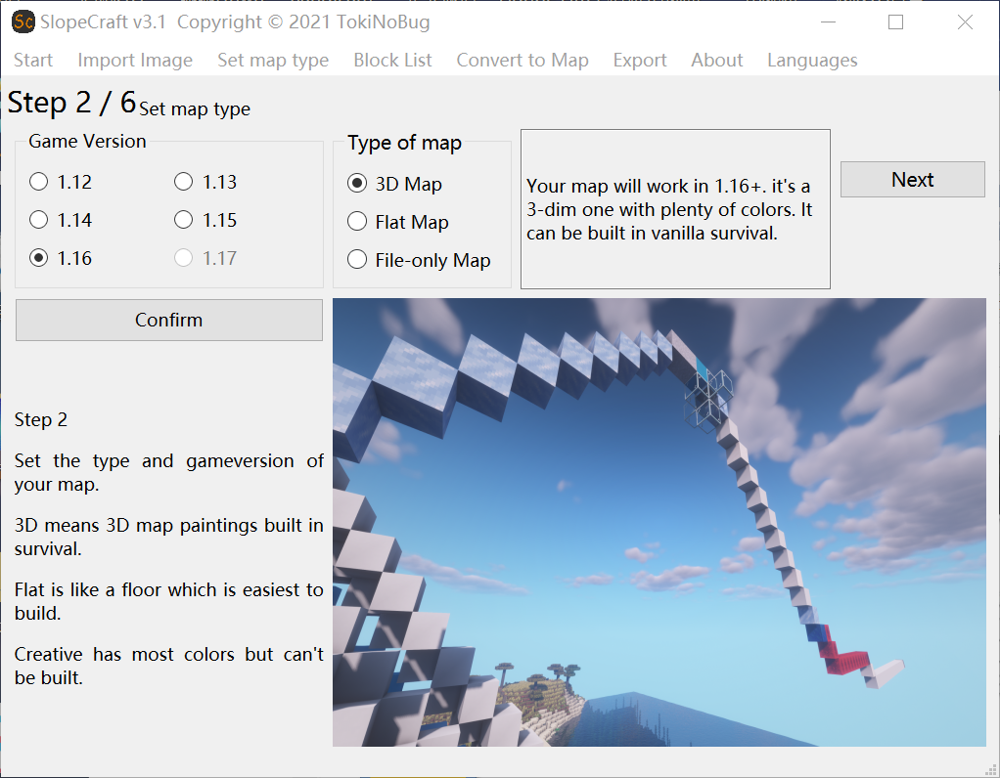

   First select the version of Minecraft. From 1.12 to 1.16 is supported, and 1.17 in future.

   Notice that **there's no differences among quanlitiy of map paintings in 1.12 to 1.15**, **51** colors for flat maps, **153** colors for 3D maps and **204** for file-only maps.

   7 more base colors are added at 1.16, allowing **58** colors for flat maps, **174** for 3D maps and **232** colors for file-only maps.
   
   Although you have already set the types of your map at the beginning page, you can reset it again here. Reset nothing is ok.

   Click **Confirm** and the some details will be shown on the box.

   After that, click **Next**.

4. Deploy Blocklist
   
   Blocklist is just the **material list** or **palette** of a map painting. **It determins how many color your map has and which to use for every color.**
   This page is a bit complex, so I will introduce each part.**(Usually it's not required to adjust blocklist manually.)**

   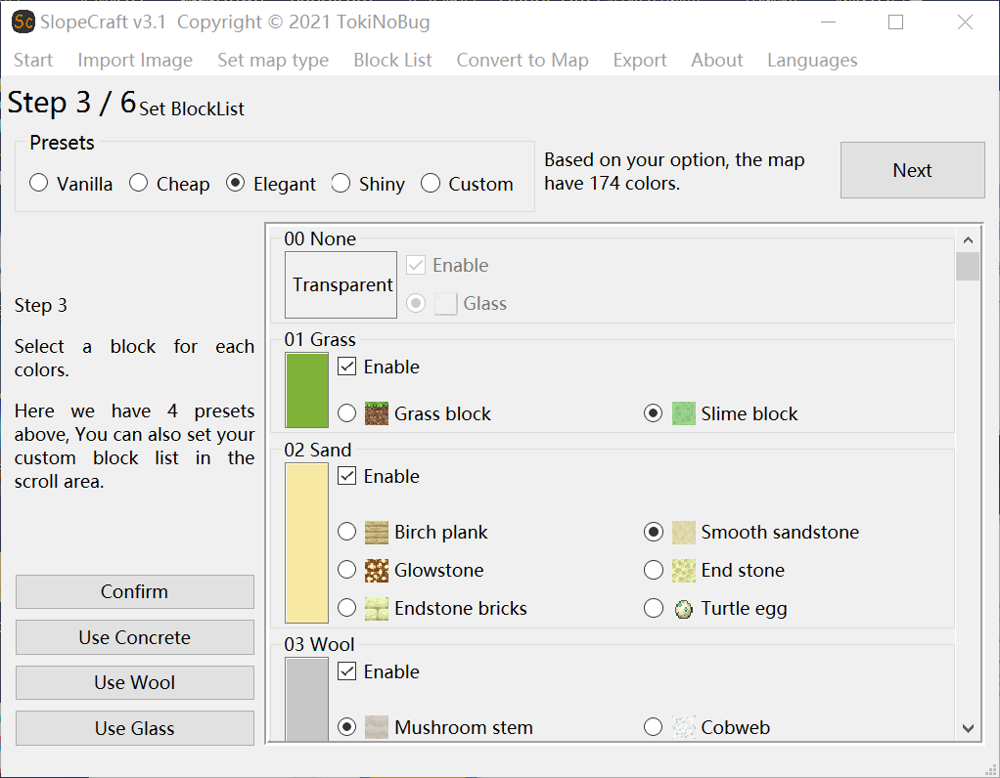

   1. Every base colors is shown in the scroll area. In the **Enable** checkbox you can choose **whether SlopeCraft will use this kind of color**. In default case, every base colors will be enabled unless they aren't supported in current version of minecraft.
   
   2. All blocks corresponding to map colors is shown under the Enable checkbox. Each color in the palette can use only one kind of block.
   
        - You may find that many blocks have different colors, but remember that **these blocks look the same in the "eye of map"**. When choosing blocks, the only criterion is mass production.
        - Some base colors have only one block avaliable but our palette can't accept blanking. Thus these radio buttons are unchangeable, like glass and emerabled block, they must be selected even though never used.
  
   3. There're 4 presets to be chosen:
   
       - Vanilla is of **original taste of minecraft maps**, trying my best to use the "oringinal block" of each color. Suitable for creative mod but not for building in vanilla survival.(Tons of diamond blocks, for example)
       - Cheap tries to choose the **cheapest blocks**, assuring that every block can be produce massively. Suitable for earlier stage of vanilla survial.
       - Elegant tries to use the **most elegant blocks** under the princple of **mass production**. Such as blocks that are both pretty and mass-productive. It would be better if the block can't be stolen by enderman. This is the default preset.
       - **Shiny is born for shaders**, trying to choose glowing blocks, making its best effort to make your map gorgeous with shaders.
       - Custom means that a customized block list will be used.
  
      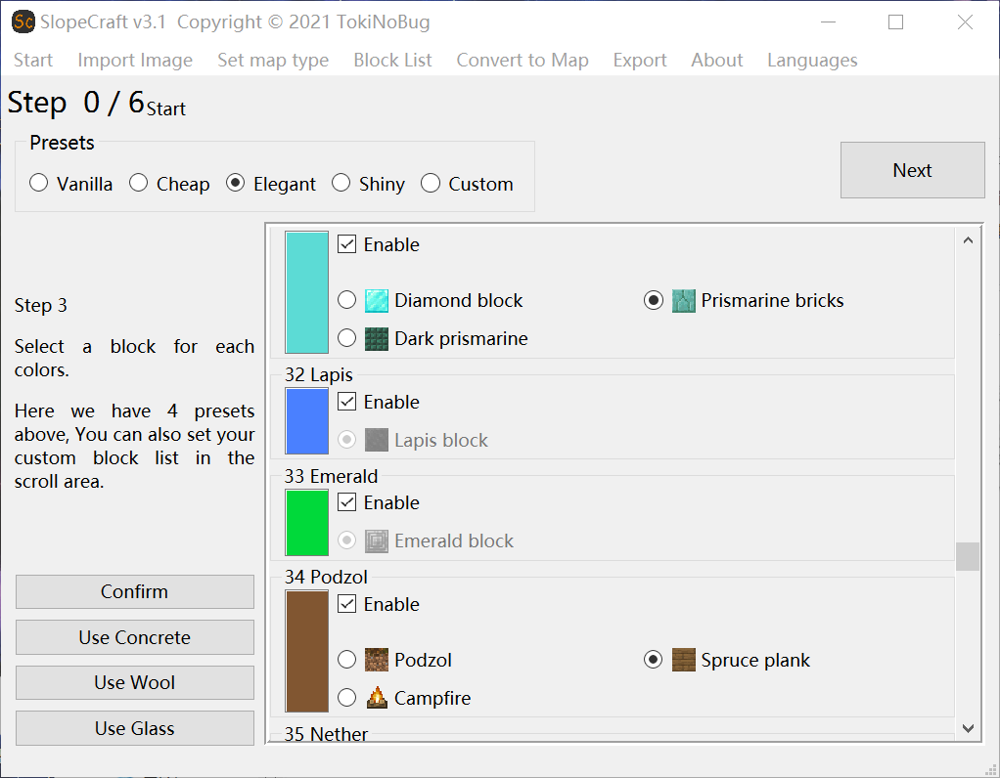

   4. Buttons at bottom left coner, like **Use Concrete** enables you to customize your blocklist rapidly.
   
   After finishing these, click **Confirm** and SlopeCraft will tell you **how many colors it will use**.

    If you disabled som base colors, the amount of colors will be less. **The more colors in palette and the larger you image is, the better quality your map painting is.** When it comes to how to balance between quanlity and building difficulity, It's up to you.

    Click **Confirm** and go on.

5. Adjustment of colors
   
   Since all lead works are done, let's get to business: convert your image into map painting.

   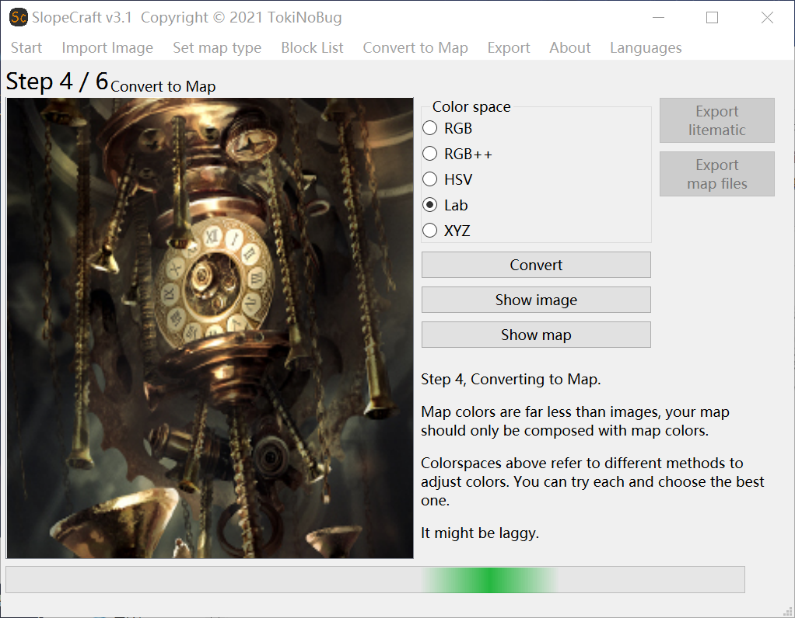

   The **Convert**button will adjust the colors of source image to colors in you palette, while **Show image** and **Show map** button under it will respectively show the source image and converted map painting so that you can compare them.

   Here we have 5 selection of **ColorSpace**, refering to **5 different methods of convertion**.These 5 methods have different results.

   Everybody hope that our map painting is as similar to source image as possible, thus you can try all five methods. It's suggested to compare and assume the effect of each method and choose the best one.

   It might be laggy during convertion, especially for large pictures.
   **If the progress bar suddenly stopped and the window is not responding, DON'T CLOSE THE WINDOW, DON'T DO ANYTHING, SIMPLY WAIT UNTIL SLOPECRAFT FINISH IT.**
   Threre're often great caculation tasks, due to my limited skills, lagging is normal condition.

   Having chosen the best method, let's go to the final step  of generation: **exportion**.

## Step 3  Export

   There're 2 kinds of exportion: **export as litematic** and **export as map data files**. Different type of exportion should be applied for different kind of maps:

   - 3D maps:export as litematic
   - Flat maps:export as litematic
   - File-only maps:export as map data files

(**Litematic refers to schematic file of litematic mod developed by Masa**)

(Actually 3D maps and flat maps can be also exported as map data files, but it's of little sense.)

### Export as Litematic

1. Once the convertion is finished, the **Export litematic** button will light up. Click it.
   
   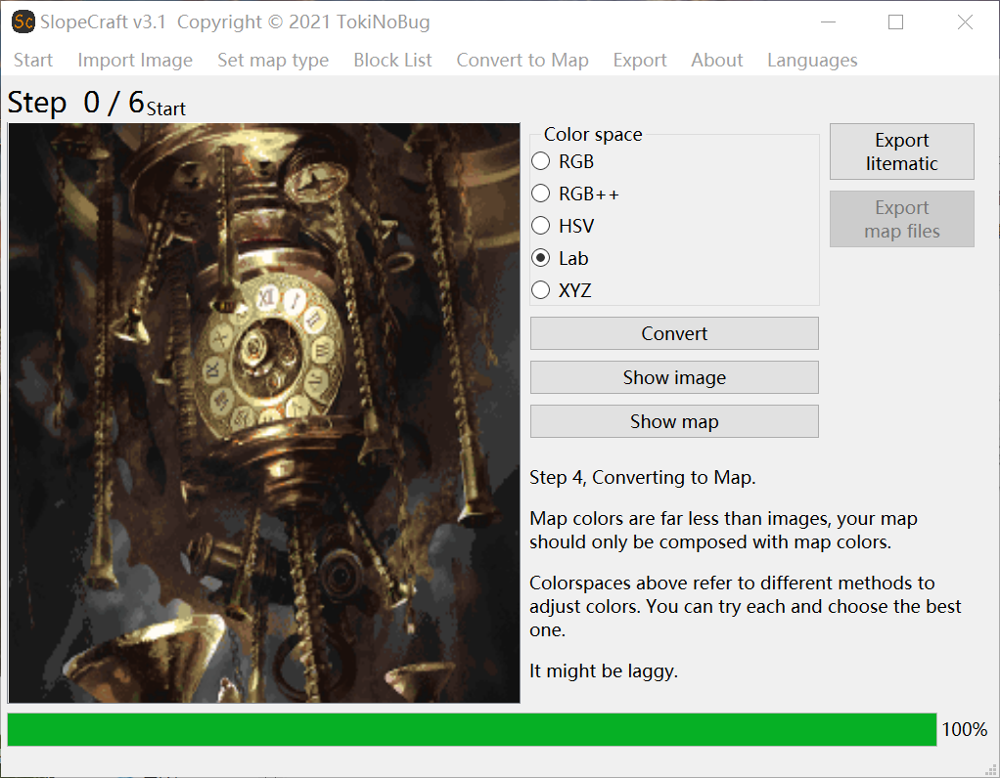

2. Build 3D structure
   
   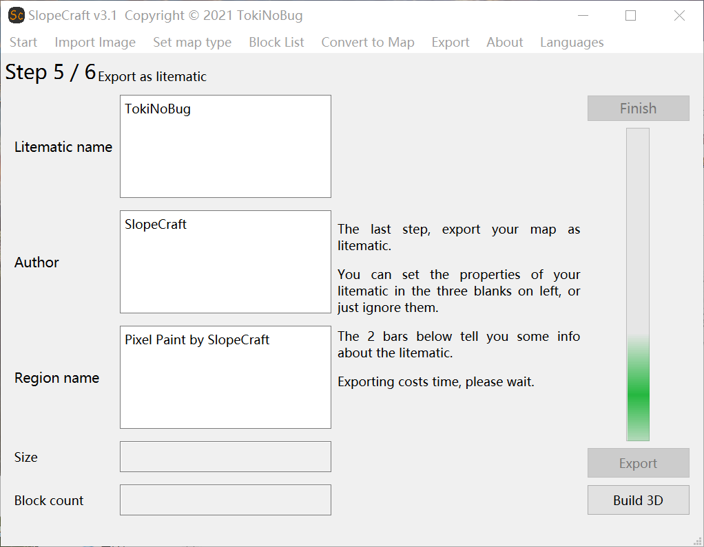

   Click **Build 3D** sothat SlopeCraft will transform map picture into a 3D structure, telling you the size and block count of the litematic.

   **Notice that if the height of litematic (y size) goes greater that 256, NEVER NEVER CONTINUE TO EXPORT. A litematic higher than 256 meaningless!**

   If you such happened, some skills may help:

   - Resize the image to a smaller one
   - Back to previous step and change another colorspace.
   - Rotate the image and generate again.
   - Adjust the hue and saturation of your image and generate again.
   - Change another image.

3. Export litematic files
   
   Fill in **Litematic name**, **Author** and **Region name** blanks.(**Optional**)(**Input English characters only, or litematic mod may fail to read your litematic**)，click **Export**.

   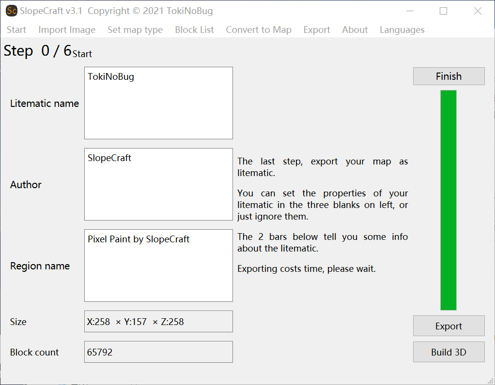

4. Bring litematic file to litematic mod
   
   Click **Finish**, goto the last page.

   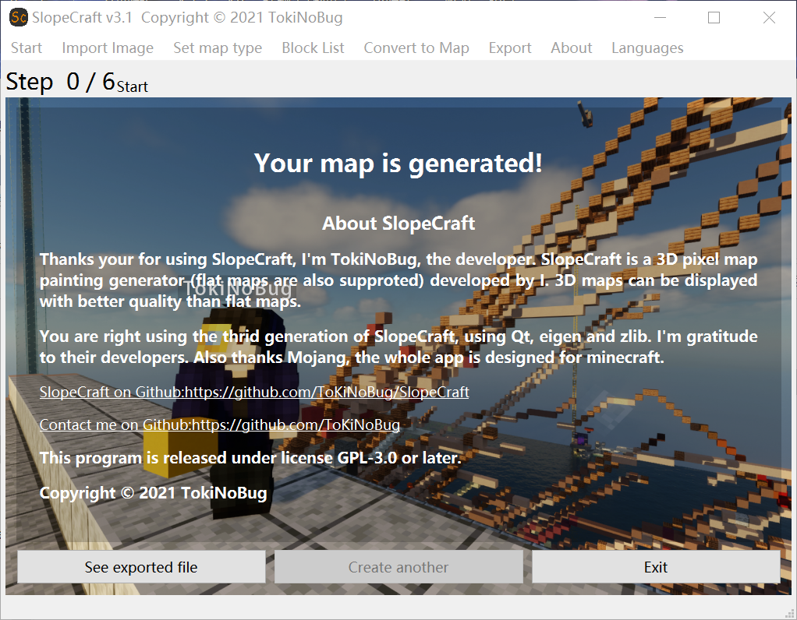

   Click **See exported file** and SlopeCraft will show the litematic file to you. Click **Exit**.

   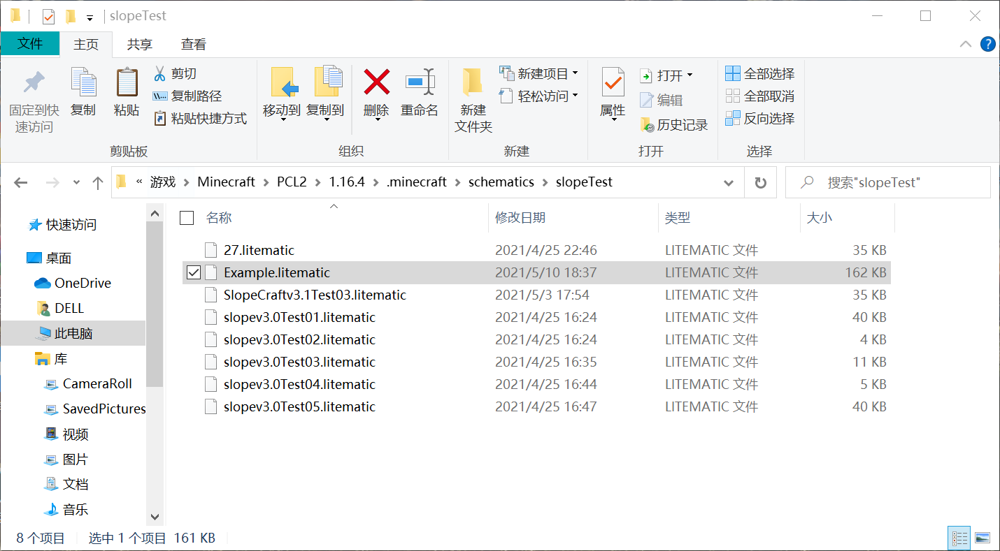

   Then, move the litematic files to *.minecraft/schematic* folder. Start Minecraft and enter a server/world, load your litematic files, place it at where you want to build it.

   When you place the schematic, notice that **the x and z coordinates of orgin must be any number of -65+k×128. k is an arbitrary integer.** There's no limit on y coordinate. For example, the origin coordinate could be (63,62,-65). **Only in this way can your map painting get aligned to the area of a map.**

   Build this litematic or just paste it.

   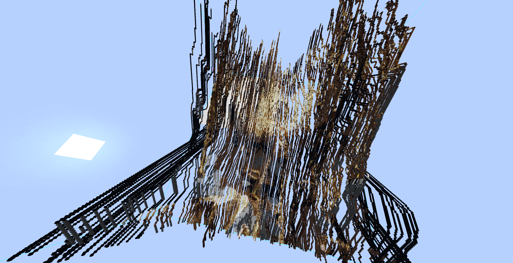

   After that, use a empty map in every area of a map. Each map should be non-scaled, each pixel corresponds to a block.

   In my example I made a 2×2-maped map painting, sot I should creat 2×2, that will be 4 maps items.

   If the version of Minecraft is above or equal to 1.14, it's suggested to lock the map item with a glass pane.

   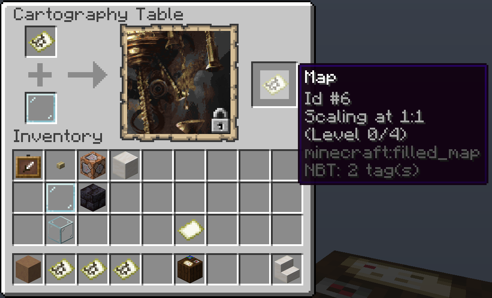
   
   Put maps into item frams in order. That's all.

   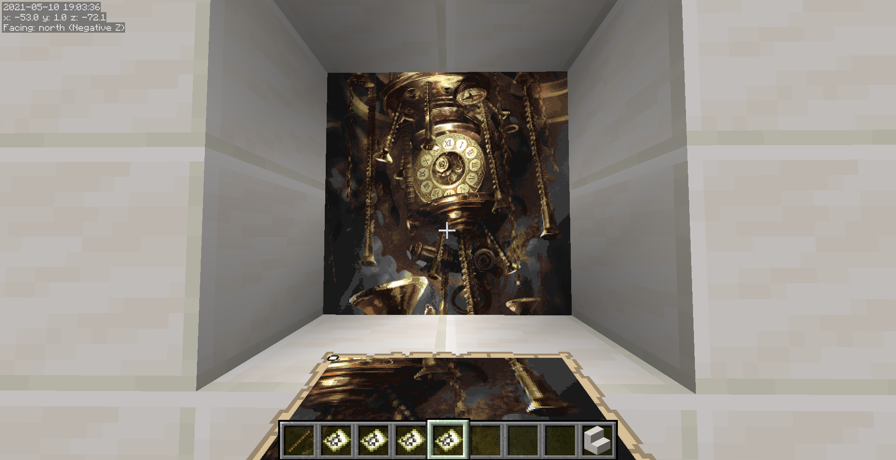

### Export as Map Files
1. Having converted the image, the **Export map files** button will light up.
   
   

   Click it and jump to the corresponding page.

   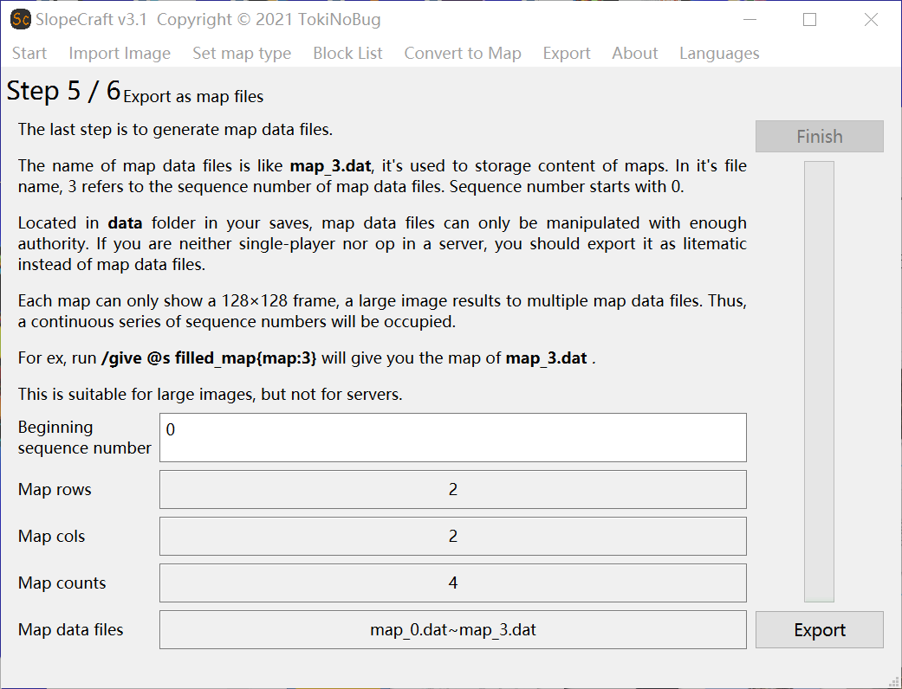

   Map painting's rows, cols, count of maps and filenames are shown on this page.

2. Set the beginning sequence number of map data files.
   
   The name of map data files are like map_i.dat, i is an arbritrary integar greater or equal to 0. For example, map_3.dat. **i is the sequence of this map data files. Sequence numbers are the only sign of map data files.** Normally, map data files we generated should'n replace any unrelated map data files, so be cautious when setting the beginning sequence number.

   In Minecraft, press F3+H will enable you to view details about any item, **including id of a map, that's right the sequence number of corresponding map data file.** Picture below shows a map item corresponding to a map data files named *map_6.dat*.

   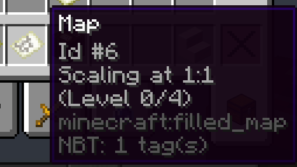

   - If you want to get map through /give command:
   You can set the beginning sequence number freely as long as it won't replace any exisiting map data file.

     - In 1.12, use `/give @s filled_map 1 i` to get the map of map_i.dat.
     - In 1.13+, use `/give @s filled_map{map:i}` to get the map of map_i.dat.
  
   - If you want to replace map data files instead of use command:

      1. Creat `n` maps corresponding to your map painting, n is the count of map data files shown in SlopeCraft. In my example, `n` is 4.
      2. Press <kbd>F3</kbd>+<kbd>H</kbd> to see the sequence numbers of those maps. It should be `a` to `a+n-1`, n ones in total.
      3. Exit the game and switch to SlopeCraft, fill the value of a into **Beginning sequence number** blank.
      4. Click Export and select the *data* folder under your save. SlopeCraft will replace those n ones map data files.
      5. Exit SlopeCraft and start Minecraft again. Those `n` ones maps should be replaced into map paintings successfully.
      6. If you are afraid of putting wrong beginning sequence number, resulting to unrelated maps been replaced, you can creat a temproray folder to put exported map data files. Select this folder when exporting. Then move them into *data* folder.

## Example

In the example in this tutorial, one litematic file(*Example.litematic*) and four map data files(in *MapDataFiles* folder) are exported.